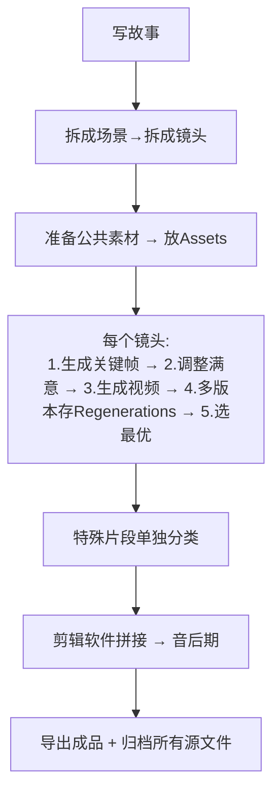

# Hell Grind 提炼：AI短视频工业化工作流完整指南

> 基于 https://higgsfield.ai/@higgsfield.studio/projects/hell-grind 开源项目提炼

## 目录
- [一、核心原则](#一核心原则)
- [二、具体创作步骤](#二具体创作步骤)
- [三、完整工作流](#三完整工作流)
- [四、注意事项](#四注意事项)
- [五、给短视频创作者的启发](#五给短视频创作者的启发)

---

## 一、核心原则

这个项目没有写文字教程，但通过11万+个文件的组织结构，告诉了你专业团队做AI电影的底层逻辑：

### 1. **拆分原则** — 把大问题切成AI能搞定的小块
AI现在还做不到"一句话生成完整长片"，但能稳定搞定单个镜头。
- Hell Grind：90分钟 → 拆成 **69个独立场景** → 每个场景再拆成镜头
- 对你：5分钟短视频 → 拆成 **10-15个独立镜头** → 一个一个搞定

### 2. **版本保留原则** — 不要覆盖，全部保留
`Regenerations` 目录单独放了 **14593个文件**，这是最有价值的实践：
- AI一次生成满意的概率很低
- 每次修改生成新版本，保留所有历史
- 方便对比选优，错了可以随时回退
- 从不相信"一次到位"，相信"迭代出好货"

### 3. **分类原则** — 按功能清晰分类
- 公共素材统一放 `Assets`
- 特殊片段（闪回、回忆）单独分类放 `Flashbacks`
- 每个场景/镜头独立文件夹
- 参考来源/信用状单独放 `Credits`

### 4. **透明归档原则** — 所有内容都留档
从提示词到生成过程，每一步都保留——方便自己复盘，也方便后人学习。

---

## 二、具体创作步骤

严格按照 Hell Grind 的实践，步骤是：

### 步骤1：**故事脚本化**
1. 写完整故事/文案
2. 把故事拆成场景（Scene）
3. 每个场景拆成镜头，给每个镜头编号
4. 给每个镜头写清楚：时长、内容、运镜、风格、台词

### 步骤2：**准备公共素材**
- 在 `Assets` 目录放：
  - 角色参考图
  - 风格参考图
  - 背景音乐
  - 音效素材

### 步骤3：**逐镜头生成**
对于每个镜头：
1. **先生成关键帧（静态图）** — 定好构图、光影、角色样子
2. **调整到静态满意** — 不满意就反复改，放 `Regenerations` 存版本
3. **静态满意了再生成视频** — 别浪费时间在不满意的构图上
4. **视频也多生成几个版本** — 同样存 `Regenerations`
5. **选出最优版本** — 进入下一步

### 步骤4：**特殊片段单独处理**
闪回、回忆、大场面战斗这些特殊类型，单独建文件夹分类管理——方便统一风格，修改时也不容易乱。

### 步骤5：**剪辑合成**
1. 把所有选中的镜头导出
2. 导入剪辑软件（剪映/Pr/FCPX）
3. 调整节奏、加转场
4. 混音乐音效
5. 加字幕

### 步骤6：**导出成品 + 归档**
- 导出最终视频
- 所有源文件、项目文件按上面的目录结构归档
- 把好用的提示词、模型参数记录到 README，沉淀成自己的资产

---

## 三、完整工作流



### 推荐目录结构（直接抄）

```
your-shortfilm/
├── README.md          # 项目说明、提示词总结、模型版本
├── assets/            # 公共素材：参考图、音乐、音效、角色设定
├── scenes/
│   ├── 01-opening/    # 每个镜头/场景一个文件夹
│   ├── 02-xxx/
│   └── ...
├── regenerations/     # 所有重生成版本放在这里
├── flashbacks/        # 闪回/回忆等特殊片段（可选）
└── credits/           # 参考来源、授权信息
```

---

## 四、注意事项（从项目里读出来的坑）

### ❌ 不要一上来就生成全片
很多人犯这个错："AI帮我生成一个5分钟故事"——现在AI做不到，这么干只会得到垃圾。必须拆分。

### ❌ 不要删除旧版本
你觉得"这个版本不好看"删掉了，改了十版后发现还是第一版好，找不回来了。记住：**磁盘比你的记忆靠谱，全部保留**。

### ❌ 不要混放素材
所有公共素材放一起，每个场景干净整洁——找东西快，改的时候不会错。

### ❌ 不要静图没满意就生成视频
静态构图光影都不对，生成视频也是浪费时间。先静后动，这是Hell Grind走通的路。

### ❌ 不要指望AI端到端给你成品
这个项目11万个文件，最后还是要剪才能成片——AI是生产力工具，帮你生成素材，剪辑还是要你自己来把控节奏。

---

## 五、推荐工具链

这个项目本身就是在 **Higgsfield** 平台上完成的，官方工具链是：

| 步骤 | 推荐工具 | 说明 |
|------|----------|------|
| 故事脚本 | 任何笔记工具（Notion/飞书/语雀） | 拆分镜头写提示词用 |
| 静态关键帧生成 | **Higgsfield Image / Midjourney / DALL-E 3** | 定构图风格 |
| 视频生成 | **Higgsfield Seedance 2.5 / Runway / Pika Labs** | 从关键帧生成视频 |
| 项目管理 | Higgsfield Canvas | 在线画布管理所有素材，Hell Grind 就是用这个 |
| 剪辑合成 | 剪映 / Adobe Premiere / Final Cut Pro | 看你习惯 |
| 提示词归档 | GitHub / 本地笔记 | 沉淀复用 |

### Hell Grind 官方用的工具：
- 全部创作在 **Higgsfield Cinema Studio** 内完成
- 用平台的 **Seedance 2.5** 做AI视频生成
- 平台提供超级计算机算力，支持大项目批量生成

### 普通人做短视频的替代方案：
- 如果想用免费/开源工具：Stable Video Diffusion 本地部署
- 如果想用云端方便：Pika Labs（Discord）/ Runway 都可以
- 工作流是一样的，工具只是载体，方法论不变

---

## 六、给短视频创作者的启发

Hell Grind 是AI电影的里程碑，它证明了一件事：

> **AI工业化生产视频的方法论，就是「传统电影工业化 + AI逐镜头生成」**

这个方法缩小了用在短视频上，完全就是降维打击：
- 别人还在玩"一句话生成视频"碰运气
- 你用专业团队的拆分+迭代工作流稳定出片

对于想做几分钟AI短视频的人来说，这条路已经被专业团队走通了，你直接抄作业就行。

---

*From [ai-shortfilm-workflow](https://github.com/zengguangzhong/ai-shortfilm-workflow)*
